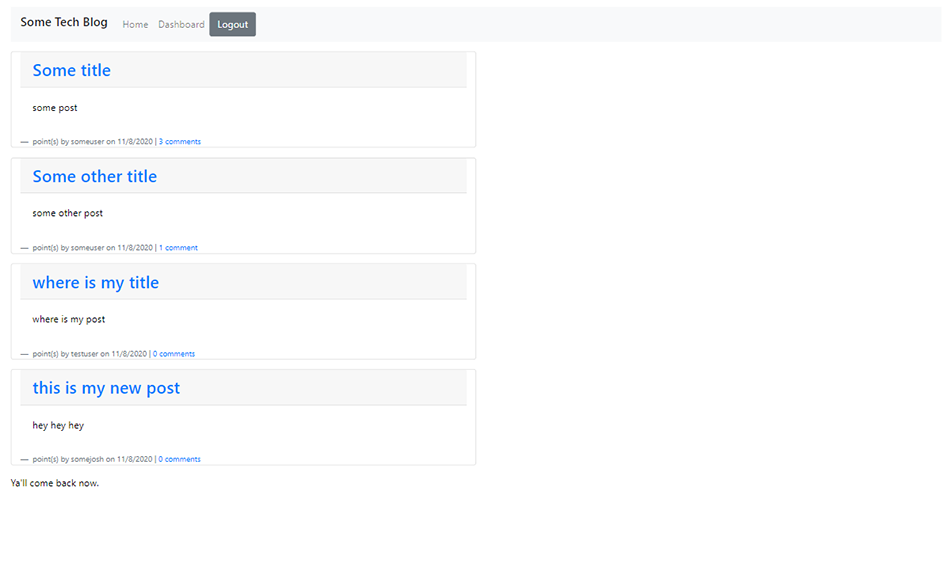

___
# Tech Blog - Full-Stack Web Application

## Description

This was a website, built using MVC paradigm.

**To Be Noted:**
I used the [express-handlebars package](https://www.npmjs.com/package/express-handlebars), [MySQL2 package](https://www.npmjs.com/package/mysql2), [Express-Handlebars framework](https://www.npmjs.com/package/express-handlebars), and honestly a whole bunch of others, check out my package.json if you really want to know.

**Other:** I have changed the below badges since I submitted the assignment and will probably change the screenshot at some point to something with funnier Blog titles and blurbs. 

**Regrets:** I wish I had more time to really style this with what I had in mind. I realized I could use Bootstrap and that was both cool and fun to use, but I'd like to give it more personal touches as well as make some obvious things easier to interact with. You know, throw a margin here or there, or a display flex on this or that. Or make a certian text box larger lol.


## Table of Contents 

* [License](#license)
* [Installation](#installation)
* [Usage](#usage)
* [Screenshot](#screenshot)
* [Deployed](#deployed)


## License

[](https://opensource.org/licenses/BSD-2-Clause)

## Installation 

First star it. 
Then you could either fork it or download a zip file of it.

You should also have Node and MySQL installed to your machine.

Then hit ```npm i``` to install all of the packages included in the package.json file.

## Usage

**All of the details for npm shortcuts are stored in the package.json**

Replace with your own info in the config/connection.js

```npm start``` will run the application.

## Credits

I got help from the TAs and my tutor!

## How You Can Reach Me

If you'd like to ask further questions you can reach me via [GitHub](https://github.com/cat-lin-morgan/) or email me at plummorgan@gmail.com!

### Deployed

[Click here for the application deployed to Heroku!](https://gentle-harbor-12576.herokuapp.com/ "Tech Blog")

### Screenshot



___Thank you___

___
